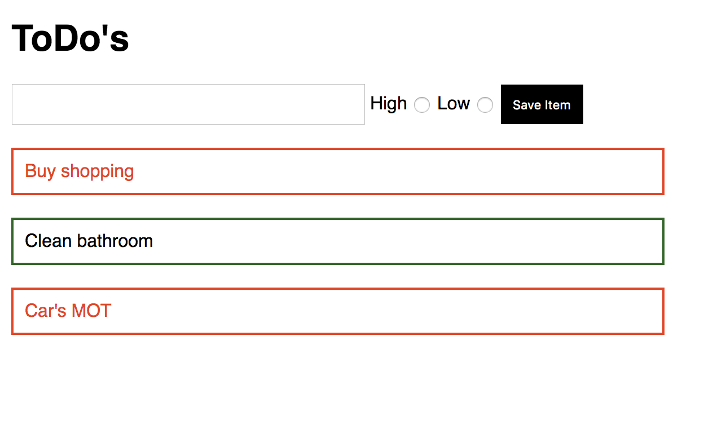

# Homework: ToDo List

## Learning Objectives

- Be able to set up a basic Vue application
- Be able to use forms with `v-model`
- Be able to use `v-on` to manage user events

## Brief

Your task is to create a todo list application that allows a user to save an item to a list which then renders on the page.

Use Vue and Webpack to build a solution that looks like this:



## MVP

V- Render a list of todos from an array of strings.  
V- Add the capability to add a new todo to the list.

Your todos array would look something like:
```js
todos: [
  "Buy shopping", "Clean bathroom", "Car's MOT"
]
```

## Extensions

V- Update the todos array to take in objects with keys of name and priority.
V- Add radio buttons to track the level of priority
V- Give the user visual feedback on what todos are high priority

## Setup

1. npm init and install `vue`, `webpack` and `webpack-cli`.

2. Add build script to `package.json`.

3. Create folder and file structure.

Your folder structure might look like this:

- public
	- css
	- js
	- index.html
- src
	- app.js
- .gitignore
- package.json
- webpack.config.js

4. Create `webpack.config.js` file and add configuration.

For your convenience, here is a sample webpack configuration:

```js
const config = {
  entry: `${__dirname}/src/app.js`,
  output: {
    path: `${__dirname}/public/js/`,
    filename: 'bundle.js'
  },
  resolve: {
    alias: {
      'vue$': 'vue/dist/vue.esm.js'
    },
    extensions: ['*', '.js', '.vue', '.json']
  },
  mode: 'development'
};

module.exports = config;
```

5. Create simple HTML file with a div with id of `app`

6. In `app.js` import `vue` and create a new instance passing in config object with `em: '#app'` as starting point.

7. npm run build.

8. open index.html and make sure you can see `vue` dev tools.

9. Develop!!
